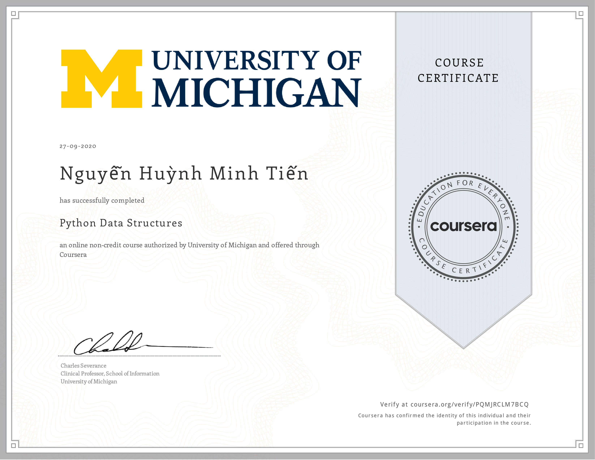
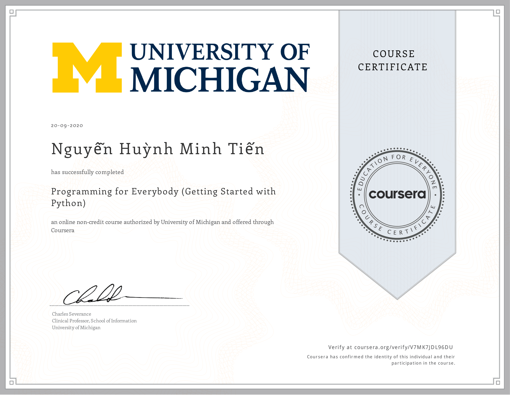
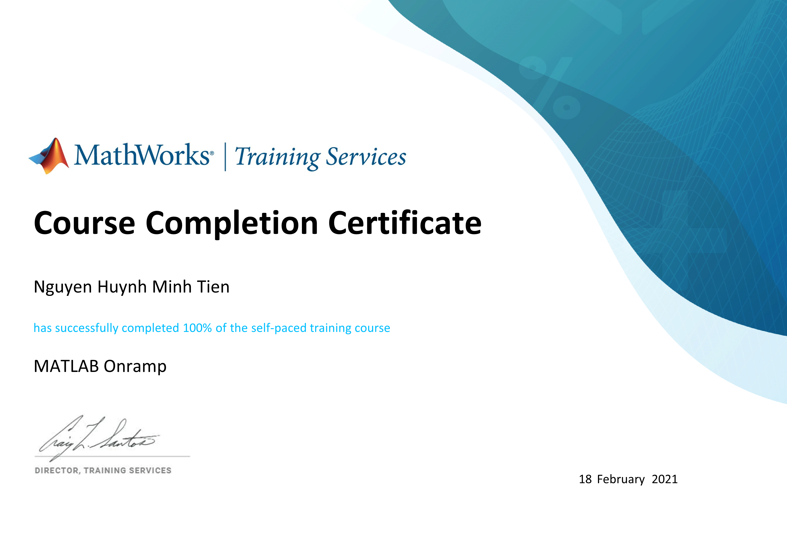
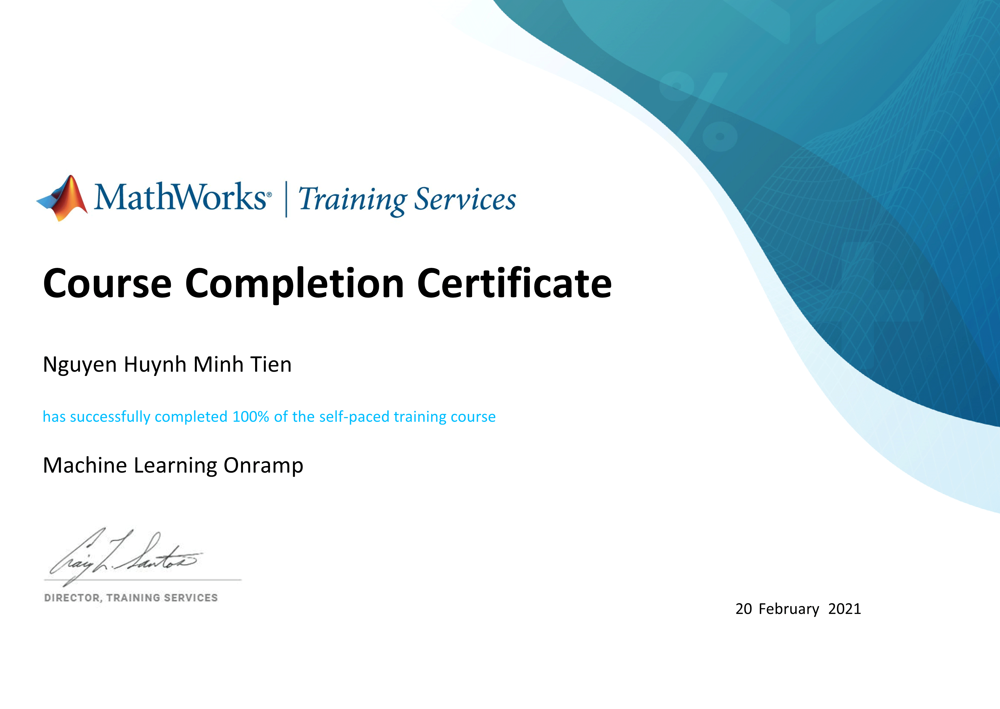

<h1 align="center">Hi 👋, I'm Minh Tien</h1>

<h3 align="center">A passionate developer from Vietnam </h3>

   

 

- ✍ I'm a student of: [Ho Chi Minh city University of Technology and Education](https://hcmute.edu.vn) (HCMUTE).

- 🌱 I’m currently learning **Deep learning and Computer vision.**

- 👨‍💻 All of my projects are available at [https://tiennhm.github.io](https://tiennhm.github.io)

- 💬 Ask me about **C, C#, Python**

## 📫 How to reach me:
Email: [***tiennhm.it@gmail.com***](mailto:tiennhm.it@gmail.com)

    

-----

## Professional skills:

 
  
  
  
  
  
   

## Tools:

  
  
  
  
  
  
  

----

  &nbsp;
  

----

# Certificates:

  
  

  
  

